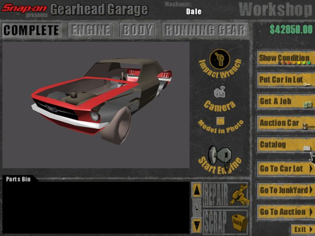
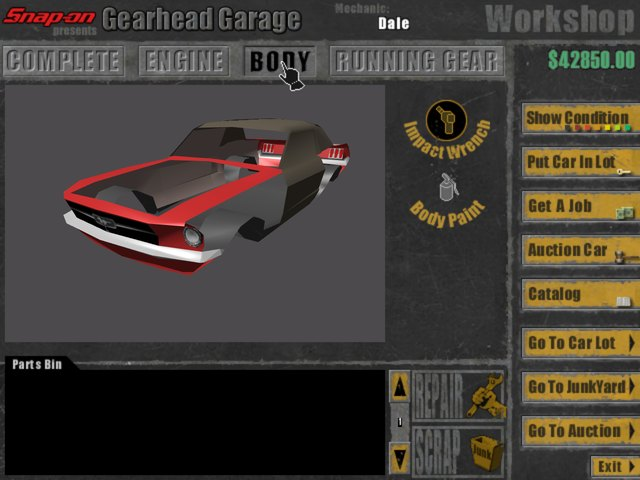
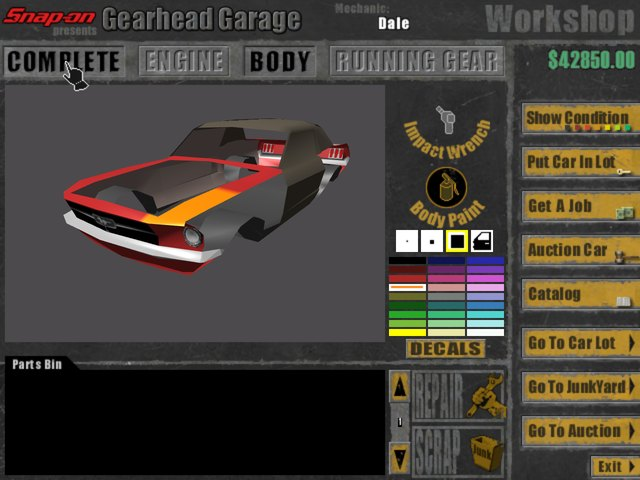
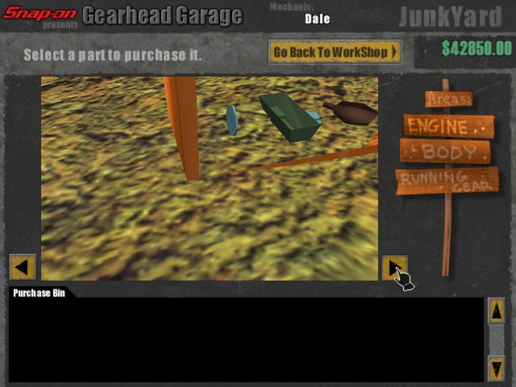
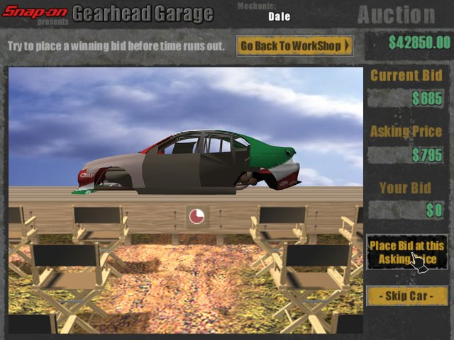
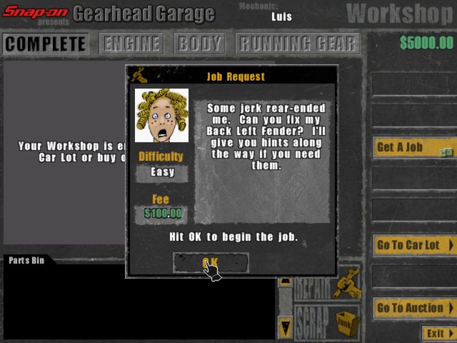
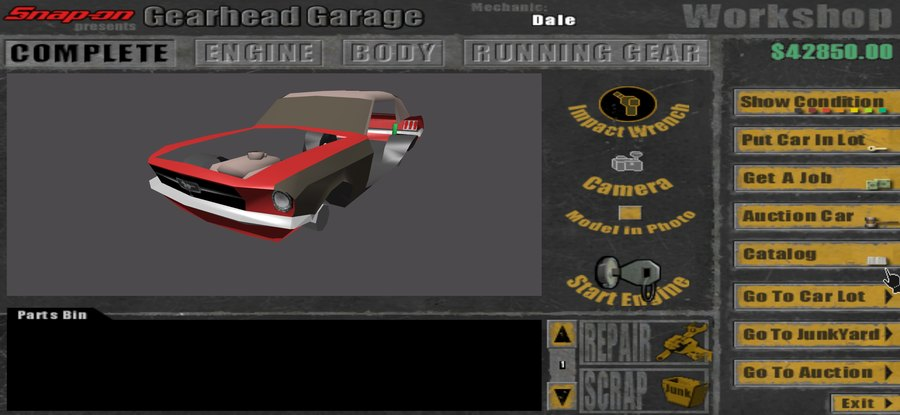
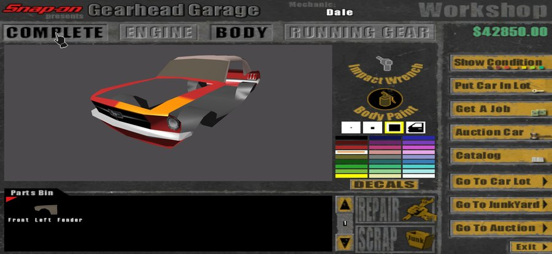

<div align="center">


<p><em>Snap-on Gearhead Garage (Mekada, 1999), rebuilt for Direct3D 12 on Windows and for Android</em></p>

<a href="#">

</a>

<br/>

[](https://en.cppreference.com/w/cpp/23)
[](#-building)
[](#-building)
[](#-the-rebuild-and-the-1999-original)
[](vendor/VanGUI/BUILD-INFO.md)
[](https://www.teamvanilla.org/)

<br/>

[](../../stargazers)
[](../../issues)
[](../../commits)
[](../../releases)

<br/>

[](#-the-rebuild-and-the-1999-original)
[](#-features-at-a-glance)
[](#-features-at-a-glance)
[](#-features-at-a-glance)
[](#-building)
[](#-tests)

</div>


**Snap-on Gearhead Garage: The Virtual Mechanic** is the car repair game Mekada (Ratloop, Inc.) made in 1999: you buy worn-out cars, take them apart bolt by bolt, repair or replace what is worn, and sell them on or fix customers' cars for pay. This repository is TeamVanilla's rebuild of it: a new program, `GearheadGarage.exe`, that reads the 1999 game's own files and plays them on **Direct3D 12** (Direct3D 11 and OpenGL as fallbacks) on Windows 10 and 11, and on **OpenGL ES 3** on Android phones and tablets.

The original `ghg.exe` (the build of 2002-04-22) was taken apart and written down in [`Docs/Research.md`](Docs/Research.md), then rebuilt screen by screen: the WorkShop and its wrench, the Parts Bin, the Catalog, the JunkYard, the Car Lot, the Auction, jobs, Body Paint, decals, photos and the jukebox. **None of the old program runs.** Everything a player sees and hears (the screens, cars, sounds, music and jobs) comes from the retail data, read in place.

Ready-to-play downloads for Windows and Android are at **[ghg.teamvanilla.dev](https://ghg.teamvanilla.dev)**.

<p align="center">



<br/>



<br/>


<br/>
<sub>Windows at 1280 x 960 (top two rows) and a Galaxy S25 Ultra at 2340 x 1080. Taken with the game itself by <code>GGWebs/tools/shots.py</code>.</sub>
</p>

<div align="center">

### 📑 Contents

[Features](#-features-at-a-glance) · [The Rebuild and the 1999 Original](#-the-rebuild-and-the-1999-original) · [Playing](#-playing) · [Requirements](#-requirements)

[Building](#-building) · [Command Line](#-command-line) · [Tests](#-tests) · [Reverse Engineering](#-reverse-engineering)

[Repository Layout](#-repository-layout) · [Known Limitations](#-known-limitations) · [Credits and Ownership](#-credits-and-ownership) · [Links](#-links)

</div>


## ✨ Features at a Glance

**The game, as it was**
- **WorkShop**: four views (Complete, Engine, Body, Running Gear); the Air Ratchet and Impact Wrench take a part off bolt by bolt; Show Condition colours every part by its wear (Perfect, Worn, Barely, Scrap); the Parts Bin carries parts to REPAIR or SCRAP; Start Engine, the ASSEMBLED tag and Top Condition
- **Catalog**: new parts for the car in the WorkShop, chapter by chapter, and decals by the pack
- **JunkYard**: three walkable areas (Engine, Body, Running Gear) of used parts, their shelves and the Purchase Bin
- **Car Lot and Auction**: the cars a mechanic owns; buying and selling against the six bidders before the clock runs out
- **Jobs**: the 31 jobs written for the game, then made-up ones from its phrase book, with portraits, Job Help, budgets and the victory tune
- **Body Paint and decals**: four brushes and 27 colours, painted through the view onto the car; the Decal Browser turns, flips, sizes and tints
- **Photos**: the WorkShop camera and Model in Photo, saved as a JPEG and a thumbnail in `Data\SnapShots`
- **Careers**: ten mechanics on the sign-in sheet, each moving up from Learning to Mekada; saved in the 1999 `.mek` format, so a career from the original plays on

**What the rebuild adds**
- **Three renderers on Windows**: Direct3D 12 first; Direct3D 11 and OpenGL (through ANGLE) take over on a card that cannot start it
- **Any window, any screen**: 640 x 480 up to 2560 x 1920, or full screen; the picture fills the screen or stays 4:3 with bars, and the 3D views widen instead of stretching
- **Mouse and touch**: drag the car to turn it, the wheel or a pinch brings it nearer, and the JunkYard and Car Lot walk by dragging; the arrow keys still work
- **The whole game on Android**: the APK carries the game's data and the engine mounts its own package as a zip; saves and photos go to the app's folder, where a fan's car dropped into `Data/Cars` shows up
- **One exe, no launcher**: the C runtime is linked in and ANGLE rides inside the exe, unpacked on first use; the old launcher's display options and snapshot browser live on the sign-in sheet's Settings page
- **Settings**: renderer, window, picture, vertical sync, a frame limit (60, 120, 144 or 240), anti-aliasing up to 8x, a frame counter, volumes, music and printable photo copies
- **Crash reports**: `game.log` names the build, the graphics card and its driver, and where a crash happened; every shipped build's PDB is kept in `symbols/` for `Source/Tools/symbolize.py`


## 🧭 The Rebuild and the 1999 Original

| | 1999 `ghg.exe` | **`GearheadGarage.exe`** |
|---|---|---|
| **Graphics** | DirectX 7, through a modified Twilight3D engine | **Direct3D 12, 11 or OpenGL (ANGLE) on Windows; OpenGL ES 3 on Android** |
| **Screen** | 640 x 480 | **Any window up to 2560 x 1920, or full screen; fill or 4:3** |
| **Runs on** | Windows 95 and 98 (not NT), Pentium 166, 32 MB | **Windows 10 and 11 x64; Android 7 and newer** |
| **Starting** | The `Gearhead.exe` launcher (MFC) starts `ghg.exe` | **Opens straight onto the sign-in sheet** |
| **Turning the car** | Arrow keys; right mouse button | **Also dragging it, the wheel, one finger and a pinch** |
| **The data** | `Data\*.dat` archives, `.car`, `.dpk`, `.jpk` | **The same files, read in place, or from inside the APK** |
| **Mechanics** | `Data\Mechanics\N.mek` | **The same files, in the same format** |
| **Installing** | CD, DirectX 7, Internet Explorer 5 | **Unzip and run; or install the APK** |


## 🎮 Playing

Download the game from **[ghg.teamvanilla.dev](https://ghg.teamvanilla.dev/download/)**: a zip for Windows (unzip it somewhere you can write to and run `GearheadGarage.exe`) or an APK for Android. Each carries the whole game.

| Windows | Android | Does |
|---|---|---|
| Left button | Tap, or touch and drag | Click and drag: buttons, the wrench, the Parts Bin, the spray can |
| Drag the car | Drag the car | Turn it in the WorkShop; a press that stays put is the tool's click |
| Right button, dragged | Two fingers | Turn the car while the spray can is out |
| Mouse wheel | Pinch | Bring the car nearer or farther |
| Drag the view | Drag the view | Walk along the JunkYard or the Car Lot |
| <kbd>←</kbd> <kbd>↑</kbd> <kbd>→</kbd> <kbd>↓</kbd> | | Turn the car, as in the original |
| <kbd>Esc</kbd> | Back | Back out of a place to the WorkShop; close Settings or the credits |

The full guide (a career's first steps, skills, money, where the files are) is on the website's [Guide](https://ghg.teamvanilla.dev/guide/) page.


## 🧰 Requirements

| | |
|---|---|
| **The game's data** | A retail install of Gearhead Garage in `Game/` (a `Data` folder holding `Gfx24.dat` and `Cars/`) |
| **Compiler** | MSVC with C++23 (Visual Studio 2026, generator `Visual Studio 18 2026`) |
| **CMake** | 3.28 or newer |
| **Python** | `py` on the PATH: the shader step runs at build time; the tools use Pillow, NumPy and `pefile` |
| **Windows target** | x64 only (configure with `-A x64`) |
| **Android** | Android SDK in `%LOCALAPPDATA%\Android\Sdk` (platform-tools, build-tools 36.1.0, platform android-36, NDK 29) and a JDK; no Gradle |

Vendored in `vendor/`: VanGUI (prebuilt `/MT` for Windows, built from source per ABI for Android), ANGLE, the Khronos headers, stb, and DXC with SPIRV-Cross for the shader step.


## 🔨 Building

### Windows

```bat
cmake -S . -B build/x64 -G "Visual Studio 18 2026" -A x64
cmake --build build/x64 --config Release --target GearheadGarage
```

The exe lands in `bin/GearheadGarage.exe`. It finds the game in `Game/` beside or above it, then in the folder named by `game_dir.txt`, and otherwise asks for it. The build also makes `ghgcheck` (reads every archive and car with the game's own readers and reports what it found) and `packres`.

### Android

```bat
py Source/Tools/build_apk.py                 :: all three ABIs
py Source/Tools/build_apk.py --abis arm64-v8a --install
```

`build_apk.py` builds `libghg.so` per ABI with the NDK, compiles the Java side with `d8`, links the resources with `aapt2`, packs `Game/Data` into the APK as `assets/Data` (cars deflated, archives stored, each car's header on its own in `assets/Data/CarHeads` so the Catalog starts without unpacking every car), then zipaligns and signs it. The result is `Share/Android/GearheadGarage.apk` (package `org.teamvanilla.ghg`, minSdk 24, targetSdk 35). `--install` puts it on the phone `adb` sees and starts it.

> ⚠️ The first build makes the release key in `Android/keystore/`. Keep it, and keep it private: Android installs an update over the app only when both are signed with the same key.

### What players get

```bat
py Source/Tools/make_share.py --zip
```

`Share/PC/GearheadGarage/` is the exe with the game's `Data` beside it, a README, the licences and a manifest with sizes and SHA-256; `--zip` adds `Share/PC/GearheadGarage-PC.zip`. Each build's exe and PDB are kept in `symbols/<GUID+age>/`, and the Android libraries in `symbols/android/<version>/`.

### The website

`GGWebs/` is ghg.teamvanilla.dev: static pages built by `py GGWebs/tools/build.py`. See [`GGWebs/README.md`](GGWebs/README.md).


## 💻 Command Line

| Option | Does |
|---|---|
| `--game <dir or .apk>` | The game to play: a folder holding `Data`, or the Android APK (the PC build reads the package's data too) |
| `--saves <dir>` | Where mechanics and photos go (default: the game's own `Data` folder) |
| `--d3d12` · `--d3d11` · `--gles` | Draw with that renderer this time |
| `--warp` | Draw with Windows' software renderer: slow, but it tells a driver problem from a game problem |
| `--size <W>x<H>` | The window's size for this run |
| `--script <file>` | Play a test script (see [Tests](#-tests)) |
| `--shot <file.png>` | Draw one frame of the first screen to a PNG and exit |
| `--mechanic <n>` | Sign in as mechanic `n` (`Mechanics\n.mek`) |
| `--screen <name>` | Open on `signin`, `workshop`, `catalog`, `junkyard`, `carlot`, `auction` or `credits` |
| `--job <id>` | Offer that job at once (the original's `-JobID`) |
| `--car <id> [--skill <n>]` | Start in the WorkShop with that car, never saved (the original's `-CarID`) |
| `--console` · `--d3ddebug` | A console for the log; the Direct3D debug layer |


## 🧪 Tests

`Tests/` holds 20 scripts that play the game the way a player would (`point <part>`, `clickhere`, `wheel n` and the like) and save a screenshot at each step (`shot`): the WorkShop and its wrench, the Parts Bin, repair, the Catalog, the JunkYard, the Car Lot, the Auction (buying and selling), jobs, paint, photos, settings, and dragging the car and the places.

```bat
bin\GearheadGarage.exe --game Game --saves <scratch> --mechanic 0 --script Tests\workshop_wrench.txt
```

Scripts change the mechanic's file, so point `--saves` at a scratch folder holding a copy of the mechanic (`Mechanics\0.mek`); `Game/` then stays as it was. Each script's first lines say what it plays and how to run it, and `Source/Tools/re/mekedit.py` makes test mechanics (jobs done, skill, cash).


## 🔬 Reverse Engineering

[`Docs/Research.md`](Docs/Research.md) is everything learned about the original program, with addresses: the `.dat` archives (a keyed XOR table, Thin-ICE blocks and zlib), the tagged files (`.car .dpk .jpk .mek`), the car format, and how each place works, from the Parts Bin's rules and the wrench's bolts to the Auction's bidders, made-up jobs, Body Paint and the launcher.

`Source/Tools/re/` is the kit it came from:

| Tool | Does |
|---|---|
| `ghg.py func\|dis\|xrefs\|str` | Disassembly, cross-references and strings over the unpacked `ghg.exe` |
| `pseudo.py <addr>` | Lifts a function to readable pseudo-code |
| `funcmap.py` · `callers.py` | Function map and call graph |
| `ghgdat.py` · `ghgtag.py` · `carinfo.py` | Read the archives, tagged files and cars |
| `mekedit.py` | Edit a mechanic: jobs done, skill, cash |
| `soundaudit.py` | Checks every sound the exe names is played |


## 📁 Repository Layout

```
GearheadGarage/
├── Source/
│   ├── Engine/          ← window, input, D3D12 / D3D11 / GLES devices, mixer, VanGUI layer
│   ├── Formats/         ← readers for the retail files: .dat, tagged files, 3DS scenes, WAV
│   ├── Game/            ← the game: screens, WorkShop, parts, jobs, economy, rendering (namespace ghg)
│   ├── Shaders/         ← HLSL; DXIL and GLSL ES made from it at build time
│   └── Tools/           ← ghgcheck, packres, build_apk.py, make_share.py, symbolize.py, re/
├── Android/             ← NativeActivity, manifest, resources, icon; keystore/ (never shared)
├── Tests/               ← scripted play-throughs
├── Docs/                ← Research.md, and the pictures on this page
├── GGWebs/              ← the website, ghg.teamvanilla.dev
├── cmake/               ← source lists and the shader step
├── vendor/              ← VanGUI, ANGLE, Khronos, stb, DXC + SPIRV-Cross
├── Game/                ← the retail install the rebuild reads
├── Gameplan.md          ← the plan of record and its milestones
└── CMakeLists.txt
```

Made by the build and the tools: `build/`, `bin/`, `symbols/`, `Share/`.


## 🚧 Known Limitations

| Item | Status |
|---|---|
| **Windows x64 only** | CMake stops on a 32-bit configuration. |
| **The exe is not code-signed** | Windows SmartScreen may not recognise it: More info, then Run anyway. |
| **Not on Google Play** | The APK installs from a file; Android asks to allow the browser or file manager to install it. |
| **Some fan-made cars cannot be painted** | Many of the cars players built after 1999 have no paintable panels. |
| **Saves go into the game's folder** | As in the original, mechanics are written to `Data\Mechanics` unless `--saves` says otherwise. |
| **Uninstalling on Android removes the mechanics** | They live in the app's own folder; copy `Data/Mechanics` off the phone first to keep them. |


## 🙏 Credits and Ownership

**Gearhead Garage © 1999 Ratloop, Inc.** "Gearhead Garage", "Mekada" and the Mekada logo are trademarks of Ratloop, Inc. "Snap-on" is a registered trademark of Snap-on Incorporated. The vehicles' likenesses belong to their makers.

| The original game | |
|---|---|
| **Mekada** (Ratloop, Inc.) | Produced and developed it |
| **Lucas Pope** | Concept, design, code, art and sound |
| **Tan Sian Yue** | Vehicle models |
| **Chris Mullins** | Vehicle models, licensing |
| **Pete Gonzalez** | Business |
| **James Anderson** | Vehicle models, sound |
| **Head Games Publishing** | Published and distributed it (later part of Activision) |
| **Snap-on Tools** | Endorsed it; it carries their name |
| **Twilight3D** | Licensed the rendering engine the 1999 game used; the rebuild draws with its own |

| The rebuild | |
|---|---|
| **TeamVanilla**, 2026 | The program, the tools and the research |
| **[VanGUI](vendor/VanGUI/BUILD-INFO.md)** | TeamVanilla's interface library, MIT |
| **[ANGLE](https://chromium.googlesource.com/angle/angle)** | OpenGL on Windows, BSD 3-Clause |
| **[stb](https://github.com/nothings/stb)** | Image reading and writing, public domain or MIT |
| **[DXC](https://github.com/microsoft/DirectXShaderCompiler)** · **[SPIRV-Cross](https://github.com/KhronosGroup/SPIRV-Cross)** | The shader step at build time, University of Illinois/NCSA and Apache 2.0 |
| **zlib** | On Android, the system's zlib unpacks the game's data |


## 🔗 Links

| | |
|---|---|
| **[ghg.teamvanilla.dev](https://ghg.teamvanilla.dev)** | The rebuild's site: downloads, screenshots, the guide, the credits |
| **[gearheadgarage.com](http://www.gearheadgarage.com/)** | The original site, still up: news, updates, the forum, the demo and the FAQ |
| **[mekada.com](https://www.mekada.com/)** | Mekada's own page, which leads on to [Ratloop's](https://www.ratloop.com/?company/mekada) |
| **[dukope.com](https://dukope.com/)** | Lucas Pope's games since |
| **[172 Modded Cars for Gearhead Garage](https://archive.org/details/172-carstogearheadgarage)** | Players' cars, kept on the Internet Archive |
| **[Discord](https://discord.gg/teamvanilla)** | TeamVanilla: send `game.log` with a few words on what happened |

<div align="center">

<sub>Built and maintained by <a href="https://github.com/TsyVM">TsyVM</a> · <a href="https://www.teamvanilla.org/">TeamVanilla</a></sub>


</div>
